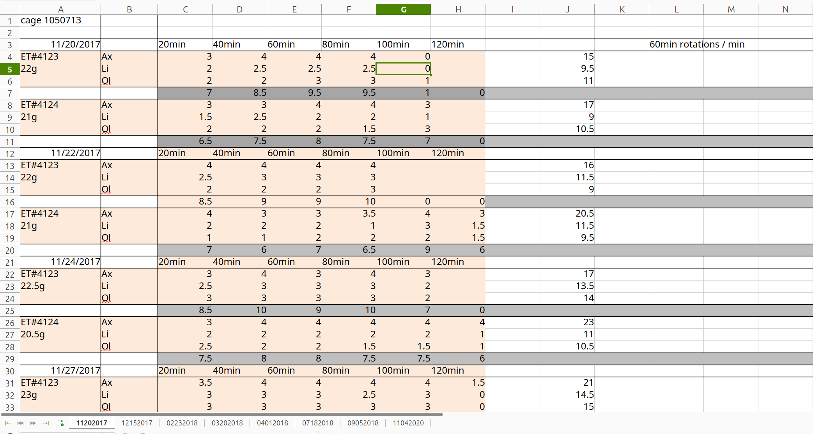

# Zhai 2025 Conversion Notes

## Paper
Here is the paper:
https://www.biorxiv.org/content/10.1101/2025.01.02.631090v1.full

## Scope of Work (Private Access)
https://docs.google.com/document/d/1ITmVEEOQ1TbBC8hvZvkdQ-VcdW9_ynUWFwfRxBBrAGQ/edit?usp=sharing


### Some glossary for better reading the paper
* **DLS** dorsolateral striatum
* **6-OHDA** 6-hydroxydopamine, a neurotoxin used to induce Parkinson's disease-like symptoms in animal models by selectively destroying dopaminergic neurons.
* **levodopa** the treatment for Parkinson's disease
* **levodopa-induced dyskinesia (LID)** a set of erratic movements induced by levodopa after long-term treatment
* **rheobase** the minimal electric current required to excite a tissue (as nerve or muscle) given an indefinitely long time during which the current is applied,
* **SPNs** spiny projection neurons
* **dSPNs** direct pathway SPNs
* **iSPNs** indirect pathway SPNs
* **AIM** lower abnormal involuntary movement (AIM)
* **Contralateral rotations** are a behavioral measure used in rodent models of Parkinson’s disease. When one side of the brain is lesioned (for example, with 6-OHDA), the imbalance in motor circuitry causes the animal to rotate predominantly toward the side opposite the lesion. By counting these rotations after a treatment like levodopa, researchers can assess changes in motor function and dyskinetic behavior.
* **M1Rs**: Muscarinic acetylcholine receptors type 1. M1 receptor activation occurs when acetylcholine (the natural neurotransmitter) or other muscarinic agonists (such as muscarine, which is where these receptors get their name) bind to the receptor. M1Rs are G-protein coupled receptors that primarily signal through the Gq/11 pathway, leading to increased neuronal excitability in many cell types including striatal indirect pathway spiny projection neurons.
* **SCH** SCH23390, a pharmacological compound that acts as a selective antagonist at the dopamine D₁ receptor (D1R). In other words, SCH23390 blocks D1-type dopaminergic signaling in neurons.
* **2PLSM** Two Photon Laser Scanning Microscopy
* **SUL/sulpiride** sulpiride, a selective D2 dopamine receptor antagonist. By blocking D2-type receptors, sulpiride is used to test whether observed changes (in this case, decreased iSPN excitability in the on-state) depend on ongoing D2R signaling.
* **Ex vivo** refers to a procedure or experiment performed on tissue taken from a living organism, but studied outside that organism’s normal biological context (for example, in a chamber or petri dish)
* **oEPSC** optogenetically evoked postsynaptic current
* **quinpirole or DA** D2R agonist(s) (
* **GRABACh3.0** is a genetically encoded fluorescent sensor designed to detect acetylcholine (ACh) release. It is used to monitor ACh dynamics in real-time.
* **AAV5-hSyn-GRAB** refers to an adeno‐associated virus (serotype 5) that uses the human synapsin promoter to drive neuronal expression of the genetically encoded acetylcholine sensor GRABACh3.0. The authors injected this viral vector into the dorsolateral striatum so that they could optically monitor acetylcholine release in brain slices. This tool was critical for assessing how cholinergic signaling changes under conditions of dopamine depletion and during levodopa-induced dyskinesia.
* **CDGI** stands for CalDAG-GEFI, a calcium-activated guanine nucleotide exchange factor that is highly expressed in the striatum. It plays a critical role in linking M1 muscarinic receptor activation to intracellular signaling pathways that regulate dendritic excitability and synaptic plasticity in indirect pathway spiny projection neurons (iSPNs). In the paper, disrupting CDGI was found to blunt the dendritic adaptations in iSPNs and reduce dyskinetic behaviors, suggesting its important role in the pathophysiology of levodopa-induced dyskinesia.
* **D1**: Direct pathway spiny projection neurons (dSPNs) that express dopamine D1 receptors
* **D2**: Indirect pathway spiny projection neurons (iSPNs) that express dopamine D2 receptors

Corroborate this:
The STK metadata in this context likely refers to metadata extracted from a MetaMorph STK file, a format used in microscopy for storing image sequences. STK files are essentially TIFF files with additional MetaMorph-specific metadata embedded in the tags. This metadata typically contains acquisition parameters, calibration details, and channel information.

These are tags appearing in the dendritic experiments of the Figures 1 and 3.

What is this Device:
 MultiClamp 700B


# Scope of Work (the conversion part)

## Conversion of Data Streams

Build interfaces to convert the following data streams to NWB format:

- Convert ABF format: I have not found .abf data
- Convert Bruker optical sensor recordings with appropriate metadata.
- Convert electrophysiological data acquired with the Bruker system
- Build an interface for manual segmentation data in Surmeier lab format.
- Integrate behavioral annotations from Surmeier lab custom format. Is this AIM scoring?
- Include behavioral video recordings. Are those
- Include electrical stimulation signals and metadata. I think this is on figure 5

Each conversion will utilize compression for efficient storage and implement chunking strategies to optimize for cloud storage. Detailed documentation will be provided for the installation and usage of the conversion software, including scripts to handle data from various protocols:
1. Ex-vivo brain slices with optogenetics: combine ABF recordings with optogenetic stimulus information.
2. Electrophysiology combined with optical imaging. Bruker optical sensor data with electrical recordings.
3. Two-photon laser scanning microscopy with electrical stimulation: process imaging data with stimulation events
4. Behavioral pharmacology: convert videos, tracking data, and drug administration metadata

The conversion of each protocol will handle the time alignment of data from each data stream.

## Which figures are related to which streams:
* Figure 1 contains recordings in xml data and the currents are on the folder organization. It also has some confocal imaging.
* Figure 2 has optogenetics and image stacks
* Figure 3 also intracellular electrophysiology
* Figure 4 like figure 2 but also has "confocal spine density" data.
* Figure 5: should have fluoresence traces. This looks like it has two photon time
* Figure 6
* Figure 7
* Figure 8

# Data Organization - Raw data for Figs

## Data Files

1. **Word File**: [Zhai et al. SA_manuscript_finalv2] - Most recent version of the submitted manuscript to Science Advances (adv8224) on 8 JAN 2025.
2. **PDF File**: [adv8224_SupplementalMaterial_v1] - Associated Supplemental Materials and Figures.
3. **Excel File**: [Key resources table_Zhai_v1] - Key resources table for relevant software (incl. Notebooks), protocols, antibodies, viruses, animals, chemicals, and hardware.
4. **Excel File**: [Data Connections] - Master sheets for raw data connections to panel figures, resources table, and some experiment metadata.
5. **Folder**: [Tabular dataset Zhai et al. 2025] - Includes readme file inside folder; spreadsheets for each Figure with separate pages for each Figure panel’s data.
6. **Folder**: [Raw data for Figs] - Folders arranged by Figure panels.

## Figure 1


```
[256K]  .
├── [256K]  Dendritic excitability
│   ├── [256K]  LID off-state -organize by condition
│   ├── [256K]  LID on-state
│   └── [256K]  LID on-state with SCH
├── [256K]  Immunostaining images (Fig. 1B) confocal images
└── [256K]  Somatic excitability
    ├── [256K]  LID off-state
    ├── [256K]  LID on-state
    └── [256K]  LID on-state with SCH
```

### Somatic Excitability
It has a readme with the following info:

Read me:
Somatic excitability data were generated by recording voltage changes in response to current injection steps that are 500 ms in duration.
> Each folder with format “XXXXXXXX_X” represents data from a cell.
> Within the cell, “cell*-00*” represents a voltage recording trace.
> “cell*-001”: injection of -120pA current…
> “cell*-006”: injection of -20pA current…
> “cell*-007”: injection of 20pA current… and so forth.

15 directories on LID on-state

```
Command: 	 du -sh ./* | pbcopyfull
27M	./04112019_1 - each of those folders is a cell
27M	./04122019_1
27M	./05012019_1
27M	./05032019_1
27M	./05072019_1
27M	./05072019_2
27M	./07062017_1
27M	./07062017_2
27M	./07072017_1
21M	./07072017_2
27M	./07192017_1
27M	./07192017_2
27M	./07202017_1
27M	./07202017_2
27M	./07212017_1
```

Let's look at one of them:

04112019_1
```
1,3M    ./cell1-001 - -120 pA
1,3M    ./cell1-002 - -100
1,3M    ./cell1-003 - -80
1,3M    ./cell1-004 - -60
1,3M    ./cell1-005 - -40
1,3M    ./cell1-006 - -20 pA
1,3M    ./cell1-007 - 20 pA
1,3M    ./cell1-008 - 40 pA
1,3M    ./cell1-009 - 60 pA
1,3M    ./cell1-010 - 80 pA
1,3M    ./cell1-011 - 100 pa
1,3M    ./cell1-012 - 120 pA
1,3M    ./cell1-013 - 140 pA
1,3M    ./cell1-014 - 160 pA
1,3M    ./cell1-015 - 180 pA
1,3M    ./cell1-016 - 200 pA
1,3M    ./cell1-017 - 220 pA
1,3M    ./cell1-018 - 240 pA
1,3M    ./cell1-019 - 260 pA
1,3M    ./cell1-020 - 280 pA
1,3M    ./cell1-021 - 300 pA
```

And they look like this:

```bash
[256K]  .
├── [256K]  cell1-001
│   ├── [3.7K]  cell1-001_Cycle00001_VoltageOutput_001.xml
│   ├── [240K]  cell1-001_Cycle00001_VoltageRecording_001.csv
│   ├── [ 13K]  cell1-001_Cycle00001_VoltageRecording_001.xml
│   └── [ 554]  cell1-001.xml
├── [256K]  cell1-002
│   ├── [3.7K]  cell1-002_Cycle00001_VoltageOutput_001.xml
│   ├── [242K]  cell1-002_Cycle00001_VoltageRecording_001.csv
│   ├── [ 13K]  cell1-002_Cycle00001_VoltageRecording_001.xml
│   └── [ 554]  cell1-002.xml
├── [256K]  cell1-003
```

How do they look:

```xml
───────┬────────────────────────────────────────────────────────────────────────────────
       │ File: cell1-001.xml
───────┼────────────────────────────────────────────────────────────────────────────────
   1   │ <PVScan version="5.3.64.300" date="4/11/2019 3:17:18 PM" notes="">
   2   │   <Sequence type="VoltageRecording" cycle="1" time="15:17:18.1161356">
   3   │     <VoltageRecording name=" LIVE" triggerMode="None" cycle="1" index="1" confi
       │ gurationFile="cell1-001_Cycle00001_VoltageRecording_001.xml" dataFile="cell1-00
       │ 1_Cycle00001_VoltageRecording_001.csv" relativeTime="0" absoluteTime="0" />
   4   │     <VoltageOutput name="Step 1_-120 pA" triggerMode="None" filename="cell1-001
       │ _Cycle00001_VoltageOutput_001.xml" relativeTime="0" absoluteTime="0" />
   5   │   </Sequence>
   6   │ </PVScan>
```

- cell1-001_Cycle00001_VoltageOutput_001.xml
These is just a TimeSeries with two columns (time in ms) and Primary which from the xml should be in mv

- cell1-001_Cycle00001_VoltageRecording_001.xml
Most likely  XML describing how the raw data are acquired and scaled, which signals are recorded vs. disabled, and how the software’s user interface plots them.

- cell1-001_Cycle00001_VoltageOutput_001.xml

LID-off-state seems have the same structure.


### Dendritic Excitability

### Protocol:

Intracellular Electrophysiology

> To assess dSPN dendritic excitability in on- and off-states, a combination of patch clamp electrophysiology and two-photon laser scanning microscopy (2PLSM) was used. Specifically, dSPNs in ex vivo brain slices from off- or on-state mice were patch clamped, filled with Ca2+-sensitive dye Fluo-4 and Ca2+-insensitive dye Alexa Fluor 568 (to visualize dendrites), **and injected with brief current steps (three 2 nA injections, 2 ms each, at 50 Hz)**. These somatically delivered steps evoked spikes that back-propagated into SPN dendrites. To assess the spread of back-propagating action potentials (bAPs), 2PLSM was used to determine evoked changes in Fluo-4 fluorescence along dendrites produced by transient opening of voltage-dependent Ca2+ channels. The magnitudes of the Ca2+ signals at proximal (~40 μm from soma) and distal (~90 μm from soma) dendritic locations served as a surrogate estimate of the extent of dendritic depolarization produced by the bAPs (Fig. 1G, H). To generate an estimate of bAP invasion that was independent of dye concentration, laser intensity, and other experimental variables, the bAP-evoked Ca2+ signal in a distal dendritic segment was normalized by the bAP-evoked Ca2+ signal in the proximal region of the same dendrite. This index of dendritic excitability was significantly greater in on-state dSPNs than in off-state dSPNs (p = 0.0115) (Fig. 1I).
```
Current (nA)
  2 |   ___      ___      ___
    |  |   |    |   |    |   |
  0 |__|   |____|   |____|   |____
      <-2ms->    <-2ms->    <-2ms->
      <---20ms--><---20ms--->
```

#### Data organization

```bash
Command: 	 du -shc ./*
585M	./LID off-state
525M	./LID on-state
353M	./LID on-state with SCH
1,5G	total
```

LID on state

```bash
├── 0706a
│   ├── 0706a1 # I think those are dates July the 06th
│   └── 0706a2
├── 0706b   # Why is there a b though?
│   └── 0706b1
├── 0707a
│   ├── 0707a1
│   └── 0707a2
├── 0707b
│   ├── 07072017_Cell2_dist2_trio-001
│   ├── 07072017_Cell2_dist2_trio-002
│   ├── 07072017_Cell2_dist2_trio-003
│   ├── 07072017_Cell2_prox2_trio-001
│   ├── 07072017_Cell2_prox2_trio-002
│   └── 07072017_Cell2_prox2_trio-003
├── 0719a
│   ├── 0719a1
│   └── 0719a2
├── 0719b
│   ├── 0719b1
│   └── 0719b2
├── 0720a
│   └── 0720a1
├── 0720b
│   ├── 0720b1
│   └── 0720b2
├── 0721a
│   ├── 0721a1
│   └── 0721a2
└── 0721b
    ├── 0721b1
    └── 0721b2
```

### Structure of the folder (hypothesis)

Ask this in an email to the authors

| "a" and "b" represent different animals (biological replicates) tested on the same day, with the second level numbers (1, 2) possibly representing different brain slices or recording locations from each animal

And the directories for each cell look like this, with a proximal and a distal measurement:

With 1 and 2 being different dendritic branch

```bash
[256K]  .

```bash
[256K]  .
├── [256K]  07062017_Cell1_dist1_trio-001
│   ├── [156K]  07062017_Cell1_dist1_trio-001_Cycle00001_Ch1_000001.ome.tif
│   ├── [ 33K]  07062017_Cell1_dist1_trio-001-Cycle00001_Ch1Source.tif
│   ├── [155K]  07062017_Cell1_dist1_trio-001_Cycle00001_Ch2_000001.ome.tif
│   ├── [ 33K]  07062017_Cell1_dist1_trio-001-Cycle00001_Ch2Source.tif
│   ├── [173K]  07062017_Cell1_dist1_trio-001_Cycle00001_LineProfileData.csv
│   ├── [5.4K]  07062017_Cell1_dist1_trio-001_Cycle00001_VoltageOutput_001.xml
│   ├── [997K]  07062017_Cell1_dist1_trio-001_Cycle00001_VoltageRecording_001.csv
│   ├── [ 13K]  07062017_Cell1_dist1_trio-001_Cycle00001_VoltageRecording_001.xml
│   ├── [286K]  07062017_Cell1_dist1_trio-001.env
│   ├── [6.4K]  07062017_Cell1_dist1_trio-001.xml
│   └── [256K]  References
├── [256K]  07062017_Cell1_dist1_trio-002
│   ├── [156K]  07062017_Cell1_dist1_trio-002_Cycle00001_Ch1_000001.ome.tif
│   ├── [ 33K]  07062017_Cell1_dist1_trio-002-Cycle00001_Ch1Source.tif
│   ├── [155K]  07062017_Cell1_dist1_trio-002_Cycle00001_Ch2_000001.ome.tif
│   ├── [ 33K]  07062017_Cell1_dist1_trio-002-Cycle00001_Ch2Source.tif
│   ├── [172K]  07062017_Cell1_dist1_trio-002_Cycle00001_LineProfileData.csv
│   ├── [5.4K]  07062017_Cell1_dist1_trio-002_Cycle00001_VoltageOutput_001.xml
│   ├── [996K]  07062017_Cell1_dist1_trio-002_Cycle00001_VoltageRecording_001.csv
│   ├── [ 13K]  07062017_Cell1_dist1_trio-002_Cycle00001_VoltageRecording_001.xml
│   ├── [286K]  07062017_Cell1_dist1_trio-002.env
│   ├── [6.4K]  07062017_Cell1_dist1_trio-002.xml
│   └── [256K]  References

```
Here the format seems to be
 [date]_Cell[cell number]_[location][location number]_trio-[trial number]

I think that trio is a typo for trial? or trio because there are three stimulus?

checking the metadata for one channel
```bash
  <Pixels DimensionOrder="XYZCT" ID="Pixels:1" PhysicalSizeX="0.194576" PhysicalSizeY="0.194576" PhysicalSizeZ="1" SizeC="2" SizeT="1" SizeX="31" SizeY="2500" SizeZ="1" Type="uint16">
```

I ran ripgrep for DateTime (which is an XML tag within the recording xml file) and found the following (formatted already and ordered by date):

```
14:58:20 - 07062017_Cell1_prox1_trio-001
14:58:33 - 07062017_Cell1_prox1_trio-002  (+13 seconds)
14:58:46 - 07062017_Cell1_prox1_trio-003  (+13 seconds)
15:00:26 - 07062017_Cell1_dist1_trio-001  (+100 seconds)
15:00:42 - 07062017_Cell1_dist1_trio-002  (+16 seconds)
15:01:06 - 07062017_Cell1_dist1_trio-003  (+24 seconds)
```

Each of them is too far away from each other to be within the same stimuli (which are like ~20 milliseconds apart), so I think they are just different trials of the same stimuli. Why only three? this is not explained on the paper.

If I do the same trick for the whole collection of LID-on-state, I get the following:

| Date | Time | Experiment Path |
|------|------|-----------------|
| 07/06/2017 | 14:58:20 | 0706a/0706a1/07062017_Cell1_prox1_trio-001 |
| 07/06/2017 | 14:58:33 | 0706a/0706a1/07062017_Cell1_prox1_trio-002 |
| 07/06/2017 | 14:58:46 | 0706a/0706a1/07062017_Cell1_prox1_trio-003 |
| 07/06/2017 | 15:00:26 | 0706a/0706a1/07062017_Cell1_dist1_trio-001 |
| 07/06/2017 | 15:00:42 | 0706a/0706a1/07062017_Cell1_dist1_trio-002 |
| 07/06/2017 | 15:01:06 | 0706a/0706a1/07062017_Cell1_dist1_trio-003 |
| 07/06/2017 | 15:15:09 | 0706a/0706a2/07062017_Cell1_dist2_trio-001 |
| 07/06/2017 | 15:15:27 | 0706a/0706a2/07062017_Cell1_dist2_trio-002 |
| 07/06/2017 | 15:15:43 | 0706a/0706a2/07062017_Cell1_dist2_trio-003 |
| 07/06/2017 | 15:17:03 | 0706a/0706a2/07062017_Cell1_prox2_trio-001 |
| 07/06/2017 | 15:17:17 | 0706a/0706a2/07062017_Cell1_prox2_trio-002 |
| 07/06/2017 | 15:17:29 | 0706a/0706a2/07062017_Cell1_prox2_trio-003 |
| 07/06/2017 | 16:23:20 | 0706b/0706b1/07062017_Cell2_prox1_trio-001 |
| 07/06/2017 | 16:23:33 | 0706b/0706b1/07062017_Cell2_prox1_trio-002 |
| 07/06/2017 | 16:23:49 | 0706b/0706b1/07062017_Cell2_prox1_trio-003 |
| 07/06/2017 | 16:25:29 | 0706b/0706b1/07062017_Cell2_dist1_trio-001 |
| 07/06/2017 | 16:25:55 | 0706b/0706b1/07062017_Cell2_dist1_trio-002 |
| 07/06/2017 | 16:26:09 | 0706b/0706b1/07062017_Cell2_dist1_trio-003 |
| 07/07/2017 | 16:04:42 | 0707a/0707a1/07072017_Cell1_prox1_trio-001 |
| 07/07/2017 | 16:05:08 | 0707a/0707a1/07072017_Cell1_prox1_trio-002 |
| 07/07/2017 | 16:05:20 | 0707a/0707a1/07072017_Cell1_prox1_trio-003 |
| 07/07/2017 | 16:07:33 | 0707a/0707a1/07072017_Cell1_dist1_trio-001 |
| 07/07/2017 | 16:08:59 | 0707a/0707a1/07072017_Cell1_dist1_trio-002 |
| 07/07/2017 | 16:09:24 | 0707a/0707a1/07072017_Cell1_dist1_trio-003 |
| 07/07/2017 | 16:10:36 | 0707a/0707a2/07072017_Cell1_prox2_trio-001 |
| 07/07/2017 | 16:11:57 | 0707a/0707a2/07072017_Cell1_prox2_trio-002 |
| 07/07/2017 | 16:12:09 | 0707a/0707a2/07072017_Cell1_prox2_trio-003 |
| 07/07/2017 | 16:13:24 | 0707a/0707a2/07072017_Cell1_dist2_trio-001 |
| 07/07/2017 | 16:14:16 | 0707a/0707a2/07072017_Cell1_dist2_trio-002 |
| 07/07/2017 | 17:28:16 | 0707b/07072017_Cell2_prox2_trio-001 |
| 07/07/2017 | 17:28:48 | 0707b/07072017_Cell2_prox2_trio-002 |
| 07/07/2017 | 17:28:58 | 0707b/07072017_Cell2_prox2_trio-003 |
| 07/07/2017 | 17:30:10 | 0707b/07072017_Cell2_dist2_trio-001 |
| 07/07/2017 | 17:30:39 | 0707b/07072017_Cell2_dist2_trio-002 |
| 07/07/2017 | 17:31:01 | 0707b/07072017_Cell2_dist2_trio-003 |
| 07/19/2017 | 13:33:29 | 0719a/0719a1/07192017_Cell1_prox1_trio-001 |
| 07/19/2017 | 13:33:44 | 0719a/0719a1/07192017_Cell1_prox1_trio-002 |
| 07/19/2017 | 13:33:55 | 0719a/0719a1/07192017_Cell1_prox1_trio-003 |
| 07/19/2017 | 13:35:31 | 0719a/0719a1/07192017_Cell1_dist1_trio-001 |
| 07/19/2017 | 13:36:12 | 0719a/0719a1/07192017_Cell1_dist1_trio-003 |
| 07/19/2017 | 13:36:44 | 0719a/0719a1/07192017_Cell1_dist1_trio-002 |
| 07/19/2017 | 13:38:56 | 0719a/0719a2/07192017_Cell1_prox2_trio-001 |
| 07/19/2017 | 13:39:18 | 0719a/0719a2/07192017_Cell1_prox2_trio-002 |
| 07/19/2017 | 13:39:34 | 0719a/0719a2/07192017_Cell1_prox2_trio-003 |
| 07/19/2017 | 13:40:59 | 0719a/0719a2/07192017_Cell1_dist2_trio-001 |
| 07/19/2017 | 13:41:15 | 0719a/0719a2/07192017_Cell1_dist2_trio-002 |
| 07/19/2017 | 13:41:27 | 0719a/0719a2/07192017_Cell1_dist2_trio-003 |
| 07/19/2017 | 14:42:25 | 0719b/0719b1/07192017_Cell2_prox1_trio-001 |
| 07/19/2017 | 14:42:40 | 0719b/0719b1/07192017_Cell2_prox1_trio-002 |
| 07/19/2017 | 14:42:55 | 0719b/0719b1/07192017_Cell2_prox1_trio-003 |
| 07/19/2017 | 14:45:21 | 0719b/0719b1/07192017_Cell2_dist1_trio-001 |
| 07/19/2017 | 14:45:48 | 0719b/0719b1/07192017_Cell2_dist1_trio-002 |
| 07/19/2017 | 14:46:05 | 0719b/0719b1/07192017_Cell2_dist1_trio-003 |
| 07/19/2017 | 14:48:00 | 0719b/0719b2/07192017_Cell2_prox2_trio-001 |
| 07/19/2017 | 14:48:13 | 0719b/0719b2/07192017_Cell2_prox2_trio-002 |
| 07/19/2017 | 14:48:24 | 0719b/0719b2/07192017_Cell2_prox2_trio-003 |
| 07/19/2017 | 14:49:46 | 0719b/0719b2/07192017_Cell2_dist2_trio-001 |
| 07/19/2017 | 14:50:23 | 0719b/0719b2/07192017_Cell2_dist2_trio-002 |
| 07/19/2017 | 14:50:42 | 0719b/0719b2/07192017_Cell2_dist2_trio-003 |
| 07/20/2017 | 14:28:05 | 0720a/0720a1/07202017_Cell1_prox1_trio-001 |
| 07/20/2017 | 14:28:16 | 0720a/0720a1/07202017_Cell1_prox1_trio-002 |
| 07/20/2017 | 14:28:31 | 0720a/0720a1/07202017_Cell1_prox1_trio-003 |
| 07/20/2017 | 14:30:14 | 0720a/0720a1/07202017_Cell1_dist1_trio-001 |
| 07/20/2017 | 14:30:30 | 0720a/0720a1/07202017_Cell1_dist1_trio-002 |
| 07/20/2017 | 14:30:42 | 0720a/0720a1/07202017_Cell1_dist1_trio-003 |
| 07/20/2017 | 15:28:37 | 0720b/0720b1/07202017_Cell2_prox1_trio-001 |
| 07/20/2017 | 15:28:44 | 0720b/0720b1/07202017_Cell2_prox1_trio-002 |
| 07/20/2017 | 15:28:56 | 0720b/0720b1/07202017_Cell2_prox1_trio-003 |
| 07/20/2017 | 15:30:14 | 0720b/0720b1/07202017_Cell2_dist1_trio-001 |
| 07/20/2017 | 15:30:21 | 0720b/0720b1/07202017_Cell2_dist1_trio-002 |
| 07/20/2017 | 15:30:32 | 0720b/0720b1/07202017_Cell2_dist1_trio-003 |
| 07/20/2017 | 15:32:02 | 0720b/0720b2/07202017_Cell2_prox2_trio-001 |
| 07/20/2017 | 15:32:11 | 0720b/0720b2/07202017_Cell2_prox2_trio-002 |
| 07/20/2017 | 15:32:19 | 0720b/0720b2/07202017_Cell2_prox2_trio-003 |
| 07/20/2017 | 15:33:41 | 0720b/0720b2/07202017_Cell2_dist2_trio-001 |
| 07/20/2017 | 15:33:53 | 0720b/0720b2/07202017_Cell2_dist2_trio-002 |
| 07/20/2017 | 15:34:01 | 0720b/0720b2/07202017_Cell2_dist2_trio-003 |
| 07/21/2017 | 15:14:11 | 0721a/0721a1/07212017_Cell1_prox1_trio-001 |
| 07/21/2017 | 15:14:19 | 0721a/0721a1/07212017_Cell1_prox1_trio-002 |
| 07/21/2017 | 15:14:31 | 0721a/0721a1/07212017_Cell1_prox1_trio-003 |
| 07/21/2017 | 15:15:45 | 0721a/0721a1/07212017_Cell1_dist1_trio-001 |
| 07/21/2017 | 15:15:58 | 0721a/0721a1/07212017_Cell1_dist1_trio-002 |
| 07/21/2017 | 15:16:13 | 0721a/0721a1/07212017_Cell1_dist1_trio-003 |
| 07/21/2017 | 15:18:16 | 0721a/0721a2/07212017_Cell1_prox2_trio-001 |
| 07/21/2017 | 15:18:28 | 0721a/0721a2/07212017_Cell1_prox2_trio-002 |
| 07/21/2017 | 15:18:37 | 0721a/0721a2/07212017_Cell1_prox2_trio-003 |
| 07/21/2017 | 15:19:52 | 0721a/0721a2/07212017_Cell1_dist2_trio-001 |
| 07/21/2017 | 15:20:24 | 0721a/0721a2/07212017_Cell1_dist2_trio-003 |
| 07/21/2017 | 15:20:40 | 0721a/0721a2/07212017_Cell1_dist2_trio-002 |
| 07/21/2017 | 16:53:09 | 0721b/0721b1/07212017_Cell2_prox1_trio-001 |
| 07/21/2017 | 16:53:23 | 0721b/0721b1/07212017_Cell2_prox1_trio-002 |
| 07/21/2017 | 16:53:32 | 0721b/0721b1/07212017_Cell2_prox1_trio-003 |
| 07/21/2017 | 16:54:57 | 0721b/0721b1/07212017_Cell2_dist1_trio-001 |
| 07/21/2017 | 16:55:08 | 0721b/0721b1/07212017_Cell2_dist1_trio-002 |
| 07/21/2017 | 16:55:18 | 0721b/0721b1/07212017_Cell2_dist1_trio-003 |
| 07/21/2017 | 16:57:17 | 0721b/0721b2/07212017_Cell2_prox2_trio-002 |
| 07/21/2017 | 16:57:47 | 0721b/0721b2/07212017_Cell2_prox2_trio-003 |
| 07/21/2017 | 16:57:59 | 0721b/0721b2/07212017_Cell2_prox2_trio-001 |
| 07/21/2017 | 16:59:04 | 0721b/0721b2/07212017_Cell2_dist2_trio-001 |
| 07/21/2017 | 16:59:19 | 0721b/0721b2/07212017_Cell2_dist2_trio-002 |
| 07/21/2017 | 16:59:29 | 0721b/0721b2/07212017_Cell2_dist2_trio-003 |

This indicates that the top level is different cells but it seems that the second level is the same cell and future trials.


### Prairie View Line Scan Files

The dendritic excitability experiments in Figures 1 and 3 use Prairie View line scan recordings.

### Line Scan File Bundle Structure

Each line scan experiment is organized in a folder with the following naming pattern:
`[date]_Cell[cell number]_[location][location number]_trio-[trial number]`

For example: `07062017_Cell1_dist1_trio-001`

A complete line scan bundle contains these files:

| File | Description | Purpose |
|------|-------------|---------|
| `*_Cycle00001_Ch1_000001.ome.tif`<br>`*_Cycle00001_Ch2_000001.ome.tif` | Raw kymograph TIFF files (one per channel) | Contains the raw spatiotemporal fluorescence data with dimensions (C, T, X) where C=channels, T=time/lines, X=pixels along scan line |
| `*-Cycle00001_Ch1Source.tif`<br>`*-Cycle00001_Ch2Source.tif` | Full field-of-view snapshots | Shows where the line scan was positioned on the cell with the scan line overlay |
| `*_Cycle00001_LineProfileData.csv` | Averaged fluorescence traces | Contains the mean intensity of the scan line segment for each channel over time |
| `*_Cycle00001_VoltageOutput_001.xml` | Stimulus protocol definition | Defines timing, amplitude, and waveforms for stimulation |
| `*_Cycle00001_VoltageRecording_001.csv` | Raw electrophysiology data | Contains the recorded voltage/current signals |
| `*_Cycle00001_VoltageRecording_001.xml` | Recording metadata | Describes sampling rates, scaling factors, channel mappings for the CSV data |
| `*.env` | Environment configuration | Contains all microscope settings, scan geometry, and profile definitions |
| `*.xml` | Master experiment file | Links to all cycle files and provides high-level experiment metadata |
| `References/` | Reference directory | Contains calibration or supplementary files |

### Understanding the Raw Data for LineScans

The OME-TIFF kymograph files (`*_Cycle00001_Ch#_000001.ome.tif`) have a 3D structure with dimensions:
- First dimension (C): Channels (typically 2 - one for each PMT detector)
- Second dimension (T): Time/line index (number of consecutive line scans, e.g., 2500)
- Third dimension (X): Pixels along the scan line (e.g., 64 pixels)

The data is essentially a stack of line scans over time, where:
- Each row represents one sweep of the laser along the defined line
- The X-axis represents position along the scan line
- The intensity at each pixel represents fluorescence at that position and time

Very importantly, the line scans oversample pixels of the source image so it is not straightforward to map it.


### Key Metadata in .env Files

This data is used to freeze the status of the microscope when doing the experiments.


1. **Scan Line Geometry**:
   ```xml
   <LineScanController>
     <StraightLine XStart="0.3047" XStop="0.8000" Y="0.6328"/>
   </LineScanController>
   ```
   These are normalized coordinates (0-1) defining the start and end points of the scan line in the field of view.

2. **Profile Window Definition**:
   ```xml
   <LineScanProfiles DataFile="..._LineProfileData.csv">
     <Profile number="1" channel="1" x0="0" x1="16"/>
     <Profile number="2" channel="2" x0="0" x1="16"/>
   </LineScanProfiles>
   ```
   Defines the logical window (x0 to x1) used for each channel's profile.

3. **Optional Caliper Settings**:
   ```xml
   <LineProfileController active="True">
     <CaliperLeft value="0.25"/>
     <CaliperRight value="0.75"/>
   </LineProfileController>
   ```
   If present and active="True", these define what fraction of the profile window is used for averaging in the CSV trace.

4. **Raster Dimensions**:
   ```xml
   <PVStateValue key="pixelsPerLine" value="64"/>
   <PVStateValue key="linesPerFrame" value="1"/>
   ```
   Defines the physical sampling resolution.

### Stimuli specification in VoltageOutput XML

```json
                "WaveformComponent_PulseTrain": [
                    {
                        "Name": "Waveform Component #1",
                        "PulseCount": "1",
                        "PulseWidth": "100",
                        "PulseSpacing": "10",
                        "PulsePotentialStart": "0",
                        "PulsePotentialDelta": "0",
                        "RestPotential": "0",
                        "FirstPulseDelay": "0",
                        "Repetitions": "1",
                        "DelayBetweenReps": "0"
                    },
                    {
                        "Name": "Theta burst",
                        "PulseCount": "3",
                        "PulseWidth": "2",
                        "PulseSpacing": "18",
                        "PulsePotentialStart": "5",
                        "PulsePotentialDelta": "0",
                        "RestPotential": "0",
                        "FirstPulseDelay": "900",
                        "Repetitions": "1",
                        "DelayBetweenReps": "158"
                    },
                    {
                        "Name": "Waveform Component #2",
                        "PulseCount": "1",
                        "PulseWidth": "10",
                        "PulseSpacing": "10",
                        "PulsePotentialStart": "0",
                        "PulsePotentialDelta": "0",
                        "RestPotential": "0",
                        "FirstPulseDelay": "100",
                        "Repetitions": "1",
                        "DelayBetweenReps": "0"
                    }
                ]
```

| Experiment narrative          | Where it appears in the JSON (`Waveform[0]`, “700B”)                                      | Notes                                                                                                                        |
| ----------------------------- | ----------------------------------------------------------------------------------------- | ---------------------------------------------------------------------------------------------------------------------------- |
| *“three 2 nA injections”*     | `"PulseCount": "3"` (inside **Theta burst**)                                              | Three pulses will be synthesised.                                                                                            |
| *“2 ms each”*                 | `"PulseWidth": "2"`                                                                       | Time units are **milliseconds** because the AO update rate is 10 kHz (one point every 0.1 ms).                               |
| *“at 50 Hz”*                  | `"PulseSpacing": "18"`                                                                    | Pulse period = width + gap = 2 ms + 16 ms ≈ 18 ms → **55 Hz** (Prairie rounds to the nearest integer).                       |
| *Amplitude = 2 nA*            | `"PulsePotentialStart": "5"` together with `"UnitScaleFactor": "400"` and `"Units": "pA"` | Command amplitude in user units = 5 pA → 5 pA × 400 = **2000 pA = 2 nA** delivered to the Axon 700B current‑injection input. |
| *Baseline before/after train* | `"RestPotential": "0"`                                                                    | Holds the command at 0 pA outside the three pulses.                                                                          |
| *Start 900 ms after t = 0*    | `"FirstPulseDelay": "900"`                                                                | Gives the patch clamp time to stabilise before the burst.                                                                    |
| *Only one burst*              | `"Repetitions": "1"`                                                                      | The full three‑pulse block is performed once in this cycle.                                                                  |

## Figure 2
The data of figure 2

```
.
├── Spine density
│   ├── control dSPN
│   ├── LID off-state dSPN
│   ├── LID on-state dSPN
│   └── PD dSPN  # PD most likely means Parkinson's disease
└── Sr-oEPSC
    ├── LID off-state
    └── LID on-state
```

### Spine Density


Relevant section from the methods:

> For assessment of dendritic spine density, images of dendritic segments (proximal: ~40 μm
> from soma; distal: > 80 μm from soma) were acquired with 0.15 μm pixels with 0.3 μm z-steps.
> Images were deconvolved in AutoQuant X3.0.4 (MediaCybernetics, Rockville, MD) and semi-
> automated spine counting was performed using 3D reconstructions in NeuronStudio (CNIC, Mount
> Sinai School of Medicine, New York). On average, two proximal and two distal dendrites were
> imaged and analyzed per neuron.


This is data that counts the density of the spines and is presented as image stacks.It does not seem that the segmentation data is available but the confocal stacks are


LID on-state dSPN:

```bash
0411a2019  05012019a  0706a  0707a  0719a  0720a
04122019a  05032019a  0706b  0707b  0719b  0721a
```
Not clear why the folder have such a different name convention.

Here the bottom are confocal stacks:

```bash
.
├── 0411a2019
│   └── Decon_20190411_Cell1_dist1
├── 04122019a
│   └── Decon_20190412_Cell1_prox12
├── 05012019a
│   └── Decon_20190501_Cell1_prox12
├── 05032019a
│   ├── Decon-20190503_Cell1_dist12-001
│   └── Decon20190503_Cell1_Prox1-001
├── 0706a
│   ├── Decon_07062017_Cell1_dist1
│   ├── Decon_07062017_Cell1_dist2
│   ├── Decon_20170706_Cell1_prox12
│   └── Decon_20170706_Cell1_prox2
├── 0706b
│   ├── Decon_20170706_Cell2_dist1
│   ├── Decon_20170706_Cell2_dist2
│   ├── Decon_20170706_Cell2_prox1
│   └── Decon_20170706_Cell2_prox2
├── 0707a
│   ├── Decon_20170707_Cell1_dist1
│   ├── Decon_20170707_Cell1_dist2
│   ├── Decon_20170707_Cell1_prox1
│   └── Decon_20170707_Cell1_prox23
├── 0707b
│   ├── Decon_20170707_Cell2_prox12
│   └── Decon_20170707_Cell2_realprox12
```

Inside there seems to be stacks:

```bash
├── Decon_20170720_Cell1_dist1
│   ├── 20_ZSeries-20170720_Cell1_dist1-001_Cycle00001_Ch1_#.ome_Z001.tif
│   ├── 20_ZSeries-20170720_Cell1_dist1-001_Cycle00001_Ch1_#.ome_Z002.tif
│   ├── 20_ZSeries-20170720_Cell1_dist1-001_Cycle00001_Ch1_#.ome_Z003.tif
│   ├── 20_ZSeries-20170720_Cell1_dist1-001_Cycle00001_Ch1_#.ome_Z004.tif
│   ├── 20_ZSeries-20170720_Cell1_dist1-001_Cycle00001_Ch1_#.ome_Z005.tif
│   ├── 20_ZSeries-20170720_Cell1_dist1-001_Cycle00001_Ch1_#.ome_Z006.tif
│   ├── 20_ZSeries-20170720_Cell1_dist1-001_Cycle00001_Ch1_#.ome_Z007.tif
│   ├── 20_ZSeries-20170720_Cell1_dist1-001_Cycle00001_Ch1_#.ome_Z008.tif
│   ├── 20_ZSeries-20170720_Cell1_dist1-001_Cycle00001_Ch1_#.ome_Z009.tif
│   ├── 20_ZSeries-20170720_Cell1_dist1-001_Cycle00001_Ch1_#.ome_Z010.tif
│   ├── 20_ZSeries-20170720_Cell1_dist1-001_Cycle00001_Ch1_#.ome_Z011.tif
│   ├── 20_ZSeries-20170720_Cell1_dist1-001_Cycle00001_Ch1_#.ome_Z012.tif
│   ├── 20_ZSeries-20170720_Cell1_dist1-001_Cycle00001_Ch1_#.ome_Z013.tif

```

There is only one image per file.

### Sr-oEPSC

I think this is the sectio of the methods that describes the Sr-oEPSC experiments:

> For Sr2+-oEPSC experiments, patch pipettes (3-4 MΩ resistance) were loaded with 120 CsMeSO3, 5 NaCl, 0.25 EGTA, 10 HEPES, 4 Mg-ATP, 0.3 Na-GTP, 10 TEA, 5 QX-314 (pH 7.25,osmolarity 280-290 mOsm/L). SPNs were held at -70 mV in the voltage-clamp configuration. After patching, recording solution was changed to Ca2+-free ACSF containing 3 mM SrCl2 and 10 μM gabazine (10 μM, to suppress GABAA-mediated currents). Slices were incubated with this Ca2+-free solution for 25 min before recording. EPSCs were evoked every 30 s by whole-field LED illumination (single 0.3-ms pulses)

Importantly, these are **voltage clamp** experiments.


### Stimuli

From the above
> EPSCs were evoked every 30 s by whole-field LED illumination (single 0.3-ms pulses).

This matches what can be found in the output xml files:

```json
"Name": "LED",
"Enabled": "true",
"AOLine": "2",
"Units": "V",
"UnitScaleFactor": "1",
"UnitVoltageOffset": "0",
"UnitScaleOffset": "0",
"PlotColor": "-38476",
"WaveformComponent_PulseTrain": {
    "Name": "Waveform Component #1",
    "PulseCount": "1",
    "PulseWidth": "0.3",
    "PulseSpacing": "49.7",
    "PulsePotentialStart": "5",
    "PulsePotentialDelta": "0",
    "RestPotential": "0",
    "FirstPulseDelay": "20",
    "Repetitions": "1",
    "DelayBetweenReps": "2000"
}

```

Explanation:


| Parameter             | Value     | Description                                                   |
| --------------------- | --------- | ------------------------------------------------------------- |
| `PulseCount`          | `1`       | Only **one pulse** is delivered                               |
| `PulseWidth`          | `0.3 ms`  | The LED is turned on for **0.3 milliseconds**                 |
| `PulseSpacing`        | `49.7 ms` | Spacing between pulses (not relevant here since only 1 pulse) |
| `PulsePotentialStart` | `5 V`     | The **pulse voltage level** is 5 volts                        |
| `RestPotential`       | `0 V`     | The baseline voltage outside the pulse is 0                   |
| `FirstPulseDelay`     | `20 ms`   | The pulse begins **20 ms after the start of the trial**       |
| `Repetitions`         | `1`       | Only a single repetition of this pulse train                  |
| `DelayBetweenReps`    | `2000 ms` | Not used here (only 1 repetition)                             |

For NWB we will probably need to create an Optogenetic stimulus site and then add the stimulus to the `OptogeneticStimulusSeries` object.

```python
from pynwb.device import Device
from pynwb.ogen import OptogeneticStimulusSite

# Device
led_device = nwbfile.create_device(name="Blue LED Driver")

# Stimulus site
ogen_site = OptogeneticStimulusSite(
    name="cortical_afferents",
    device=led_device,
    description="Stimulation of ChR2-expressing corticostriatal terminals",
    excitation_lambda=470.0,  # nm, for blue LED
    location="dorsal striatum"
)
nwbfile.add_ogen_site(ogen_site)
```

not sure it is worth adding an `OptogeneticSeries` maybe take a look at the ;[ndx-optogenetics](https://github.com/rly/ndx-optogenetics
) extension:


#### Data structure
Here is the Optical Stimulation data

```bash
.
├── 07052023a
│   ├── cell1_LED14-001
│   ├── cell1_LED14-002
│   ├── cell1_LED14-003
│   ├── cell1_LED14-004
│   ├── cell1_LED14-005
│   ├── cell1_LED14-006
│   ├── cell1_LED14-007
│   ├── cell1_LED14-008
│   ├── cell1_LED14-009
│   └── cell1_LED14-010
├── 07052023b
│   ├── cell2_LED12-006
│   ├── cell2_LED12-007
│   ├── cell2_LED12-008
│   ├── cell2_LED12-009
│   ├── cell2_LED12-010
│   ├── cell2_LED12-011
│   ├── cell2_LED12-012
│   ├── cell2_LED12-013
│   ├── cell2_LED12-014
│   └── cell2_LED12-015
```

And inside there

```bash
├── cell1_LED14-001
│   ├── cell1_LED14-001_Cycle00001_VoltageOutput_001.xml
│   ├── cell1_LED14-001_Cycle00001_VoltageRecording_001.csv
│   ├── cell1_LED14-001_Cycle00001_VoltageRecording_001.xml
│   ├── cell1_LED14-001.env
│   ├── cell1_LED14-001.xml
│   └── References
├── cell1_LED14-002
│   ├── cell1_LED14-002_Cycle00001_VoltageOutput_001.xml
│   ├── cell1_LED14-002_Cycle00001_VoltageRecording_001.csv
│   ├── cell1_LED14-002_Cycle00001_VoltageRecording_001.xml
│   ├── cell1_LED14-002.env
│   ├── cell1_LED14-002.xml
```


### File Descriptions for Optical Stimulation Data

- **cell1_LED14-001_Cycle00001_VoltageOutput_001.xml**: XML file specifying the voltage output protocol for the experiment. It defines timing, amplitude, and waveforms for LED stimulation, current/voltage steps, or other output signals.

- **cell1_LED14-001_Cycle00001_VoltageRecording_001.csv**: CSV file containing raw time-series data for the recorded signals, such as membrane currents/voltages or auxiliary signals captured during the experiment.

- **cell1_LED14-001_Cycle00001_VoltageRecording_001.xml**: XML file describing metadata for the CSV recording, including sampling rates, scaling factors (e.g., pA, mV), channel mappings, and amplifier settings.

- **cell1_LED14-001.env**: Environment/configuration file containing information about the microscope or acquisition system settings (e.g., laser powers, PMT gains, etc.).

- **cell1_LED14-001.xml**: A higher-level XML file referencing the specific acquisition cycles and linking them to their respective output/recording metadata.

- **References (directory)**: A folder possibly containing calibration data or other supplementary files that further document the experimental setup or parameters.

## Figure 3

These are like the experiments of figure 1


## Figure 4

```bash
.
├── Confocal spine density
│   ├── Fig 4H
│   ├── Fig 4I
│   └── Fig 4J and Suppl Fig 5
├── Spine density (These are like figure 2)
│   ├── control iSPN
│   ├── LID off-state iSPN
│   ├── LID on-state iSPN
│   └── PD iSPN
└── Sr-oEPSC (these are like figure 2)
    ├── LID off-state
    └── LID on-state
```

Extensions found in this figure are the most varied:

```
find . -type f -name "*.*" | rev | cut -d. -f1 | rev | sort | uniq
bmp
csv
env
ims
jpg
log
lut
nd2
oif
png
pty
pzfx
roi
swc
tif
txt
xml
```

To find the specific files that has each of the formats use the command:

```bash
find . -type f -name "*.xml"
```


- **.oif files**
    Olympus Image Files – a proprietary format used by Olympus microscopy systems to store multi-dimensional (e.g., multi-channel, z-stack) raw image data.

- **.oif.files folder**
    For each `.oif` file, there is an accompanying folder (named `.oif.files`) that contains the individual components of the image. This folder holds the individual image slices, metadata, and auxiliary files related to that acquisition.

- **.roi files**
    Region of Interest files that store information about specific areas or contours drawn on the image for analysis or segmentation.

- **.pty files**
    These files likely contain parameter or pointer data associated with each image slice. They might store settings such as acquisition parameters, focus information, or metadata for that particular slice.

- **.tif files**
    TIFF (Tagged Image File Format) images – these are the actual image slices exported from the microscope system. They are widely used for storing high-quality microscopy data.

- **.lut files**
    Lookup Table files that define color maps or intensity scaling. They’re used by imaging software to render grayscale data in false color for better visualization.

- **.bmp files**
    Bitmap image files (in this case, a thumbnail image). These provide a quick, low-resolution preview of the image.

- **.log files (e.g., MATL_01_01.log)**
    Log files document processing steps, parameters, or any errors during image acquisition or subsequent processing, often generated by analysis software such as MATLAB.

- **TileConfiguration.txt**
    This text file likely contains information about how individual image tiles are arranged and stitched together to form a mosaic. It details the layout used during the image acquisition if a large area was imaged in tiles.

The raw data for Figure 4 comes from an Olympus system and includes the native multi-dimensional `.oif` files along with a folder of associated image slices (`.tif`), metadata (`.pty`), ROI definitions (`.roi`), and other auxiliary files (lookup tables, thumbnails, logs, and tile configuration). These files together allow for subsequent processing steps—such as deconvolution, segmentation, and 3D reconstruction—to accurately quantify dendritic spine density.

### Spine Density

```bash
tree -L 3 -I "*.xml|*.env|*.csv"
```

The only files are xml env and csv

### Confocal spine density

```bash
├── Fig 4H
│   ├── processed  # Contains tiffs and jpgs
│   └── raw
├── Fig 4I
│   ├── processed
│   └── raw
└── Fig 4J and Suppl Fig 5
    ├── processed-not organized yet, see if needed-denoise-decon,ims,excel files,code,combined excel
    ├── raw
    └── Spine density plots for Fig 4J and Suppl Fig 5.pzfx
```


#### Figure 4H

My reading above is that processed data contains the processed images which are the images in raw after some image processing. Let's focus on this part of the conversion.

```bash
[256K]  .
└── [256K]  5104-3 60x str_Cycle
    ├── [ 11K]  Image_01_01_01_01.oif
    ├── [256K]  Image_01_01_01_01.oif.files
    ├── [ 11K]  Image_01_01_02_01.oif
    ├── [256K]  Image_01_01_02_01.oif.files
    ├── [ 11K]  Image_01_01_03_01.oif
    ├── [256K]  Image_01_01_03_01.oif.files
    ├── [ 11K]  Image_01_01_04_01.oif
    ├── [256K]  Image_01_01_04_01.oif.files
    ├── [ 11K]  Image_01_01_05_01.oif
    ├── [256K]  Image_01_01_05_01.oif.files
    ├── [ 11K]  Image_01_01_06_01.oif
    ├── [256K]  Image_01_01_06_01.oif.files
    ├── [ 11K]  Image_01_01_07_01.oif
    ├── [256K]  Image_01_01_07_01.oif.files
    ├── [ 11K]  Image_01_01_08_01.oif
    ├── [256K]  Image_01_01_08_01.oif.files
    ├── [ 11K]  Image_01_01_09_01.oif
    ├── [256K]  Image_01_01_09_01.oif.files
    ├── [2.4K]  MATL_01_01.log
    └── [   0]  TileConfiguration.txt

```

the raw folder contains a single folder and each of them as oif files folder. I think these correspond to 9 locations within the same tissue.

note that the oif files are plan text files that contain metadata. Here an example:

```
───────┬────────────────────────────────────────────────────────────────────────────────
       │ File: Image_01_01_01_01.oif   <UTF-16LE>
───────┼────────────────────────────────────────────────────────────────────────────────
   1   │ [Acquisition Parameters Common]
   2   │ AFAE Coefficient=1.0
   3   │ Acquisition Device="FV10i"
   4   │ AcquisitionMode=1
   5   │ Cycle Interval=0
   6   │ Cycle Repeat Number=1
   7   │ FindMode=4
   8   │ ImageCaputreDate='2024-09-28 12:53:12'
   9   │ ImageCaputreDate+MilliSec=446
  10   │ IntegrationCount=4
  11   │ IntegrationType="Line Kalman"
  12   │ LaserTransmissivity01=3.5
  13   │ LaserWavelength01=473
  14   │ Number of Acquisition Channel=1
  15   │ Number of use Laser=1
  16   │ PinholeCoefficient_10X=2.5
  17   │ PinholeCoefficient_60X=2.0
  18   │ PinholeDiameter=107000
  19   │ RegionMode="None"
  20   │ RevolverPosition=1

  ...
```

An example of this file can be found in `src/surmeier_lab_to_nwb/zhai2025/assets/Image_01_01_01_01.oif`


Inside some of the files we have the following structure:

```bash
s_238358488-1826303.roi  s_C001Z009.tif  s_C001Z018.tif  s_C001Z027.tif  s_C001Z036.tif
s_C001Z001.pty           s_C001Z010.pty  s_C001Z019.pty  s_C001Z028.pty  s_C001Z037.pty
s_C001Z001.tif           s_C001Z010.tif  s_C001Z019.tif  s_C001Z028.tif  s_C001Z037.tif
...
```

The pty files are plain text and can be read directly. Here some lines:

```bash
       │ File: s_C001Z001.pty   <UTF-16LE>
───────┼────────────────────────────────────────────────────────────────────────────────
   1   │ [Acquisition Parameters Common]
   2   │ Confocal="ON"
   3   │ Magnification=60.0
   4   │ ObjectiveLens NAValue=1.35
   5   │ ObjectiveLens Name="UPLSAP60xO"
   6   │ ObjectiveLens WDValue=150000.0
   7   │ Observation Mode="LSM"
   8   │ PMTDetectingMode="Analog"
   9   │ PMTVoltage=599
  10   │ PinholeDiameter=214000
  11   │ PinholeScale=1
  ...

```
There is no metadata about the roi locations. The file with the `.roi` extension is mostly empty. I think Imaris software was used on the peprocessed data to estimat the dendritic spine density. A full example file can be found in `src/surmeier_lab_to_nwb/zhai2025/assets/example_pth_file.pty`.

#### Figure 4I

```bash
.
├── processed
│   ├── 6-OHDA
│   ├── control
│   ├── off-state
│   └── on-state
└── raw
    ├── 6-OHDA
    ├── control
    ├── off-state
    └── on-state
```

Let's focus on the raw data:

```
.
├── 6-OHDA
│   └── 8040-slide 1-slice 2-cell 1 proxi.nd2
├── control
│   └── 3824-slide 2-slice 2-cell 2 proxi.nd2
├── off-state
│   └── 8041-slide 2-slice 3-cell 2 proxi.nd2
└── on-state
    └── 8939-slide 1-slice 3-cell 2 den2 proxi.nd2

5 directories, 4 files
```


Two Python libraries are available for reading ND2 files:

### [pims_nd2](https://github.com/soft-matter/pims_nd2/tree/master)
- Relies on Nikon's proprietary SDK (it bundles it)
- More compatible with a variety of ND2 file versions
- Potentially more robust for complex or older files
- May require additional installation steps due to SDK dependency
- Used by pims

### [nd2reader](https://github.com/Open-Science-Tools/nd2reader)
- Pure Python implementation
- Easier to install and use in restricted environments
- May not handle all ND2 variants
- Less robust for edge cases compared to pims_nd2
- No longer maintained

### [nd2 tlambert03](https://talleylambert.com/nd2/)
- Uses a pure python implementation of the Nikon ND2 file format
- Handles all the variants with the "legacy" extra flag with pip installation
- has lazy loading through memmap usage
- Is used by the https://github.com/bioio-devs/bioio library that Szonja shared with me. I could use the later but the documentation of nd2 is more clear in how to access the metadata which is what we care for here.


I am going with `nd2 tlambert03` as it is the most robust and the most complete in the extraction of metadata. There is also the bioformats reader but that requires java which complicates the distribution and installation of the package.

### Processed data in Figure 4I

Both ims nad ims Imari software data are contained. How to read this in python?


## Figure 4J and Suppl Fig 5
Figure 4J showed confocal detects more spines, but Supplemental Figure 5 proved WHY and validated the central hypothesis that spine size changes, not spine number changes, drive the apparent 2PLSM oscillations. Without this validation, the spine size hypothesis would remain speculative rather than proven. But they both contain the same data.

```bash
.
├── processed-not organized yet, see if needed-denoise-decon,ims,excel files,code,combined excel
│   ├── 6-OHDA
│   ├── control
│   ├── off-state
│   └── on-state
├── raw
│   ├── 6-OHDA
│   ├── control
│   ├── off-state
│   └── on-state
└── Spine density plots for Fig 4J and Suppl Fig 5.pzfx
```

What is pzfx?
Apparently [Graph Pad](https://www.graphpad.com/)

This is a proprietary format for Prism, a software used for scientific graphing and statistical analysis. The .pzfx file format is a compressed file that contains data, graphs, and analysis results created in GraphPad Prism.

Both of them contain the same raw data in nikons nd2 format. But Figure 4I has the examples that they show on the plot whereas figure 4J has more samples.


What are:
* nd2 files:  raw image data files produced by Nikon imaging system?
* ims files: Imaris software?
* oif files: Olympus Microscope?
* pyt files:


## Figure 5

```bash
.
├── LID off (Figure 5 E)
├── PD (6-OHDA) (Figure 5 D)
└── UL control (Figure 5 C)
```
Note that each of them correspond to a paper figure

• Quinpirole is a D2 receptor agonist. When applied, it activates D2 receptors on cholinergic interneurons, leading to a suppression of ACh release.

• +DA indicates the bath application of dopamine. Adding dopamine mimics the natural ligand's effect—activating dopamine receptors (primarily D2 receptors on ChIs) and thus inhibiting ACh release.

• +Sulpiride refers to the application of a D2 receptor antagonist. By blocking D2 receptors, sulpiride prevents dopamine from exerting its inhibitory effect on ACh release, resulting in an increased evoked ACh signal.


```bash
.
├── LID off
│   ├── 05242024slice1
│   ├── 05242024slice2
│   ├── 05292024slice1
│   ├── 05292024slice2
│   ├── 05312024slice1
│   ├── 05312024slice2
│   ├── 06032024slice1
│   ├── 06042024slice1
│   ├── 06042024slice2
│   ├── 06042024slice3
│   └── 06042024slice4
├── PD
│   ├── 04122024slice1ROI1
│   ├── 04122024slice1ROI2
│   ├── 04122024slice2ROI1
│   ├── 04122024slice2ROI2
│   ├── 04162024slice1ROI1
│   ├── 04162024slice1ROI2
│   ├── 04162024slice2ROI1
│   ├── 04162024slice2ROI2
│   ├── 05092024slice1
│   └── 05092024slice2
└── UL control
    ├── 04022024slice1ROI1
    ├── 04022024slice1ROI2
    ├── 04022024slice2ROI1
    ├── 04022024slice2ROI2
    ├── 04022024slice3ROI1
    ├── 04022024slice3ROI2
    ├── 04052024slice1ROI1
    ├── 04052024slice1ROI2
    ├── 04052024slice2ROI1
    ├── 04102024slice1ROI1
    ├── 04102024slice1ROI2
    ├── 04102024slice2ROI1
    └── 04102024slice2ROI2
```

These folders contain what looks like Two Photon time series data:

```bash
├── BOT_04122024_slice1ROI1_sul_single-002
│   ├── BOT_04122024_slice1ROI1_sul_single-002_Cycle00001-botData.csv
│   ├── BOT_04122024_slice1ROI1_sul_single-002_Cycle00001_Ch2_000001.ome.tif
│   ├── BOT_04122024_slice1ROI1_sul_single-002_Cycle00001_Ch2_000002.ome.tif
│   ├── BOT_04122024_slice1ROI1_sul_single-002_Cycle00001_Ch2_000003.ome.tif
│   ├── BOT_04122024_slice1ROI1_sul_single-002_Cycle00001_Ch2_000004.ome.tif
│   ├── BOT_04122024_slice1ROI1_sul_single-002_Cycle00001_Ch2_000005.ome.tif
│   ├── BOT_04122024_slice1ROI1_sul_single-002_Cycle00001_Ch2_000006.ome.tif
│   ├── BOT_04122024_slice1ROI1_sul_single-002_Cycle00001_Ch2_000007.ome.tif
```

## Figure 6

```bash
tree -L 2
.
├── Dendritic excitability
│   ├── control
│   └── M1R antagonist
├── Somatic excitability
│   ├── control
│   └── M1R antagonist
└── Spine density
    ├── control
    └── M1R antagonist

```

## Figure 7

```bash

.
├── AIM rating
│   └── AIM testing_CDGI KO.xlsx  # This is an excel file
├── contralateral rotations
│   └── CDGI KO videos  # These are the videos
├── KO DE on vs off
│   ├── KO off-state
│   └── KO on-state
├── KO SE on vs off
│   ├── KO off-state
│   └── KO on-state
├── KO spine density
│   ├── KO off
│   └── KO on
└── oxoM on DE
    ├── KO
    ├── ReadMe.rtf
    └── WT
```
How does the excel looks like:



## Figure 8

```bash
tree -L 2
.
├── M1R CRISPR AIMs
│   └── AIM raw score_M1R CRISPR.xlsx
├── M1R CRISPR SE
│   ├── interleaved control
│   └── M1R CRISPR
└── M1R CRISPR spine density
    ├── control
    └── M1R CRISPR
```

### M1R CRISPR SE

```bash
tree -L 3 -I "*.xml|*.env|*.csv"
```
Only contains this three types of files that look like this:

```bash
.
├── cell1-001
│   ├── cell1-001_Cycle00001_VoltageOutput_001.xml
│   ├── cell1-001_Cycle00001_VoltageRecording_001.csv
│   ├── cell1-001_Cycle00001_VoltageRecording_001.xml
│   ├── cell1-001.env
│   ├── cell1-001.xml
│   └── References

```


### M1R CRISPR spine density
I expected to see spine density calculations on the M1R CRISPR spie density but there is only xml files

```bash
tree -L 4 -I "*.tif*"
.
├── control
│   ├── 20221012a
│   │   ├── Decon_20221012_cell1_dist1
│   │   ├── Decon_20221012_cell1_dist2
│   │   ├── Decon_20221012_cell1_prox1
│   │   └── Decon_20221012_cell1_prox2
│   ├── 20221012b
│   │   ├── Decon_20221012_cell2_dist1
│   │   ├── Decon_20221012_cell2_dist2
│   │   ├── Decon_20221012_cell2_prox1
│   │   └── Decon_20221012_cell2_prox23
│   ├── 20221012c
│   │   ├── Decon_20221012_cell3_dist1
│   │   ├── Decon_20221012_cell3_prox1
│   │   └── Decon_20221012_cell3_prox2
│   ├── 20221130a
│   │   ├── Decon_20221130_cell1_dist1
│   │   ├── Decon_20221130_cell1-dist2
│   │   ├── Decon_20221130_cell1_prox1
│   │   └── Decon_20221130_cell1_prox2
│   ├── 20221130b
│   │   ├── Decon_20221130_cell2_dist12
│   │   ├── Decon_20221130_cell2_prox1
│   │   └── Decon_20221130_cell2_prox2
│   └── 20221130c
│       ├── Decon_20221130_cell3_dist1
│       ├── Decon_20221130_cell3_dist2
│       └── Decon_20221130_cell3_prox12
└── M1R CRISPR
    ├── 20221004a
    │   ├── Decon_20221004_cell1_dist1
    │   ├── Decon_20221004_Cell1_medium12
    │   └── Decon_20221004_cell1_prox1
    ├── 20221004b
    │   ├── Decon_20221004_cell2_dist1
    │   ├── Decon_20221004_cell2_dist2
    │   ├── Decon_20221004_cell2_prox1
    │   └── Decon_20221004_cell2_prox23
    ├── 20221004c
    │   ├── Decon_20221004_cell3_dist1
    │   ├── Decon_20221004_cell3_dist2
    │   ├── Decon_20221004_cell3_prox1
    │   └── Decon-20221004_cell3_prox2
    ├── 20221004d
    │   ├── Decon_20221004_cell4_dist1
    │   └── Decon_20221004_cell4_prox1
    ├── 20221005a
    │   ├── Decon_20221004_cell1_dist1
    │   ├── Decon_20221004_cell1_dist2
    │   ├── Decon-20221005_cell1_prox1
    │   └── Decon_20221005_cell1_prox2
    ├── 20221005b
    │   ├── Decon-20221005_cell2_dist1
    │   └── Decon_20221005_cell2_prox1
    ├── 20221005c
    │   ├── Decon_20221005_cell3_dist1
    │   └── Decon-20221005_cell3_prox12
    ├── 20221129a
    │   ├── Decon_20221129_cell1_dist1
    │   ├── Decon_20221129_cell1_dist2
    │   ├── Decon_20221129_cell1_prox12
    │   └── Decon_20221129_cell1_prox3
    ├── 20221129b
    │   ├── Decon_20221129_cell2_dist1
    │   ├── Decon_20221129_cell2_dist2
    │   ├── Decon_20221129_cell2_prox1
    │   └── Decon_20221129_cell2_prox2
    └── 20221129c
        ├── Decon-20221129_cell3_dist12
        ├── Decon_20221129_cell3_prox1
        └── Decon_20221129_cell3_prox2
```

## Supplementary Figure 3

This seems to contain a lot of videos:


```bash
.
└── M1R CRISPR videos
    ├── 01172024-
    │   ├── 1st session
    │   ├── 2nd session
    │   ├── 3rd session
    │   ├── 4th session
    │   └── 5th session
    ├── 02232024-
    │   ├── 1st session
    │   ├── 2nd session
    │   ├── 3rd session
    │   ├── 4th session
    │   └── 5th session
    ├── 05032024-
    │   ├── 1st session
    │   ├── 2nd session
    │   ├── 3rd session
    │   ├── 4th session
    │   └── 5th session
    ├── 09272023-
    │   ├── 1st session
    │   ├── 2nd session
    │   ├── 3rd session
    │   ├── 4th session
    │   └── 5th session
    └── 12082023-
        ├── 1st session
        ├── 2nd session
        ├── 3rd session
        ├── 4th session
        └── 5th session
```

###  Acquisition

> All the electrophysiological recordings were made using a MultiClamp 700B amplifier (Axon Instrument, USA), and signals were filtered at 2 kHz and digitized at 10 kHz. Voltage protocols and data acquisition were performed by PrairieView 5.3 (Bruker). The amplifier command voltage and all light source shutter and modulator signals were sent via the PCI-NI6713 analog-to-digital converter card (National Instruments, Austin, TX).


[Ultima In Vitro Multiphoton
Microscope system](https://www.bruker.com/en/products-and-solutions/fluorescence-microscopy/multiphoton-microscopes/ultima-in-vitro.html)


### Stimuli Figure 5

> Time series images of the GRABACh3.0 were acquired with 0.388 μm × 0.388 μm pixels, 8-μs dwell time and a frame rate of 21.26 fps. After 3-s baseline acquisition, synchronous ACh release was evoked by delivering a single (1 ms x 0.3 mA) or a train of 20 electrical stimuli (1 ms x 0.3 mA at 20 Hz) by a concentric bipolar electrode (CBAPD75, FHC)

Here is the webpage:
https://www.fh-co.com/product/concentric-bipolar/

But I can't find the model number: CBAPD75 there


#### Spine Density Calculation

Two algorithms were used:

##### Two‐Photon Microscopy + NeuronStudio Segmentation
- **Image Acquisition**: Dendritic segments are imaged using two‐photon microscopy with a pixel resolution of 0.15 μm and z-steps of 0.3 μm.
- **Image Processing**: Raw images are deconvolved using AutoQuant software to enhance image quality.
- **Segmentation and Spine Counting**: A semi-automated algorithm in NeuronStudio is used for 3D reconstruction and spine counting. This method applies intensity thresholding and morphological criteria to automatically segment and count spines, which are then manually curated if necessary.

From this section of the paper
> For assessment of dendritic spine density, images of dendritic segments (proximal: ~40 μm from soma; distal: > 80 μm from soma) were acquired with 0.15 μm pixels with 0.3 μm z-steps. Images were deconvolved in AutoQuant X3.0.4 (MediaCybernetics, Rockville, MD) and semi-automated spine counting was performed using 3D reconstructions in NeuronStudio (CNIC, Mount Sinai School of Medicine, New York). On average, two proximal and two distal dendrites were imaged and analyzed per neuron.


##### High-Resolution Confocal + Imaris Segmentation
- **Image Acquisition**: High-resolution confocal images are captured from fixed brain sections using a 60× oil immersion objective (NA = 1.49), with z-steps of 0.125 μm and a pixel size of 0.09 μm.
- **Image Processing**: Images are de-noised and deconvolved using Nikon NIS-Elements software.
- **Segmentation Workflow**:
    - A “Surface” object is created in Imaris using Labkit for pixel classification, a supervised learning tool that isolates the dendritic segment from the background.
    - A “Filament” is generated to trace the dendrite, followed by spine detection using preset parameters (e.g., minimum spine head size, maximum spine length, no branched spines allowed).
    - The segmentation is refined and manually corrected as needed.


#### High resolution confocal microscopy of sparsely labeled neurons

A Nikon AXR confocal laser microscope from the Center for Advanced Microscopy & Nikon Imaging Center at Northwestern University was used to image dendritic spines from sparsely labeled iSPNs in fixed brain sections. Z-stack images were acquired with a 60x oil immersion objective (NA = 1.49) at 0.125 μm intervals with a 0.09 μm pixel size. The images were de-noised and deconvolved using Nikon NIS-Elements AR 5.41.02 software.

Dendritic segments (~30 μm in length, located ~30 μm from the soma) were analyzed for spine density using Imaris 10.0.0 software (Oxford Instruments). The dendrite of interest was isolated by creating a new Surface. The ‘Labkit for pixel classification’ tool was used to train signal detection over noise, creating a tight surface. This surface was further refined to include only the dendritic segment of interest. A Filament for the dendritic segment was generated with the aid of an embedded supervised learning function. Spine detection was performed with the following parameters: thinnest spine head set at 0.188 μm, maximum spine length set at 5 μm, and no branched spines allowed. Spines were further refined using an embedded supervised learning function and manually corrected if necessary.

### Optogenetics

> To selectively activate corticostriatal synapses, an adeno-associated virus (AAV) carrying a channelrhodopsin 2 (ChR2) expression construct (AAV5-hSyn-hChR2(H134R)-EYFP) was injected into the motor cortex ipsilateral to the 6-OHDA lesion (Fig. 2D). In brain slices from off- and on- state Drd1-Tdtomato mice, dSPNs were patched with a Cs+-containing intracellular solution and voltage-clamped. To measure unitary synaptic strength, the extracellular Ca2+ was replaced with Sr2+ (3 mM), cortical fibers were stimulated with blue LED pulses and asynchronous, excitatory postsynaptic currents (Sr2+-oEPSCs) were recorded (Fig. 2, E-F)

#### Amplitudes of Sr2-oEPSC
> Amplitudes of Sr2-oEPSCs were
analyzed automatically using TaroTools Event Detection in Igor Pro 8 (WaveMetrics, Portland,
Oregon) followed by visual verification. Events were measured between 40 ms to 400 ms after


https://www.wavemetrics.com/forum/general/igorpro-neuromatic-event-detection

### Devices

#### Bruker Ultima In Vitro Multiphoton Microscope System:

Two-photon imaging of ACh sensor

> ACh release was assessed by imaging GRABACh3.0, a genetically encoded fluorescent sensor of ACh 72, using 2PLSM. Acute slices with striatal expression of GRABACh3.0 were prepared as described above, transferred to a recording chamber, and continuously perfused with normal ACSF at 32–34°C. A two-photon laser (Chameleon Ultra II, Coherent, Santa Clara, CA) tuned to 920 nm was used to excite GRABACh3.0. Fluorescence was imaged using an Ultima In Vitro Multiphoton Microscope system (Bruker, Billerica, MA) with an Olympus 60x/0.9 NA water-immersion objective lens and a Hamamatsu H7422P-40 GaAsP PMT (490 nm to 560 nm, Hamamatsu Photonics, Japan). Time series images of the GRABACh3.0 were acquired with 0.388 μm × 0.388 μm pixels, 8-μs dwell time and a frame rate of 21.26 fps

### Chameleon Ultra II Laser (Coherent)

Slice electrophysiology (is on this section)

> The recorded SPN was visualized using 810 nm excitation laser (Chameleon Ultra II, Coherent, Santa Clara, USA). Dendritic structure was visualized by the red signal of Alexa Fluor 568 detected by a Hamamatsu R3982 side-on photomultiplier tube (PMT, 580-620 nm). Calcium transients, as signals in the green channel, were detected by a Hamamatsu H7422P-40 GaAsP PMT (490-560 nm, Hamamatsu Photonics, Japan). Signals from both channels were background subtracted before analysis. Line scan signals were acquired with 128 pixels per line resolution and 10 μs/pixel dwell time along a dendritic segment. Ca2+ signals were quantified as


### Nikon AXR Confocal Laser Microscope
### Software

AutoQuant X3.0.4: For deconvolving two-photon images.

Nikon NIS-Elements AR 5.41.02: For de-noising and deconvolving high-resolution confocal images.

NeuronStudio: For semi-automated 3D reconstruction and spine counting from two-photon images.

Imaris 10.0.0: For detailed segmentation and 3D reconstruction of dendritic spines in confocal datasets using tools like Labkit for pixel classification and filament tracing.

## Scripts
* [Python script for analyzing Prairie View 5-generated .csv files of somatic excitability data](https://doi.org/10.5281/zenodo.14145776)
* [Python script for analyzing Prairie View 5-generated .csv files of dendritic excitability data](https://doi.org/10.5281/zenodo.14163502)
* [Python script for analyzing Prairie View 5-generated .csv files of BOT imaging data](https://doi.org/10.5281/zenodo.14163731)

## Working comments:

### Somatic excitability


### Which channel is which:

"Calcium transients, as signals in the green channel, were detected by a Hamamatsu H7422P-40 GaAsP PMT (490-560 nm)"
"Dendritic structure was visualized by the red signal of Alexa Fluor 568 detected by a Hamamatsu R3982 side-on PMT (580-620 nm)"


Fluo-4 calcium-sensitive dye (green, 490-560 nm)
Alexa Fluor 568 structural dye (red, 580-620 nm)


### Find video files

How to look for files:
```bash
find . -type f \( -iname "*.mp4" -o -iname "*.mov" -o -iname "*.avi" -o -iname "*.mkv" \)
```
```bash
ls -R | rg ".MP4"
```


# Things that would ben nice to do:
- Extract the times of the intracelluar events so we can write a single time series instead of many.
- Add an extension for line scan data
- Add an extension for image stacks that keeps the metadata of the microscopy
- Separate the nwbfiles per subject
